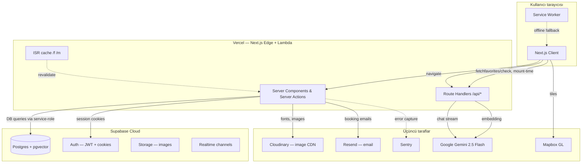
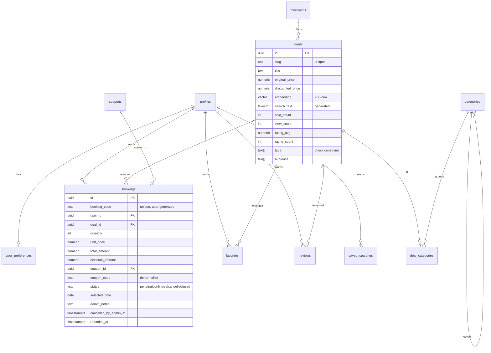
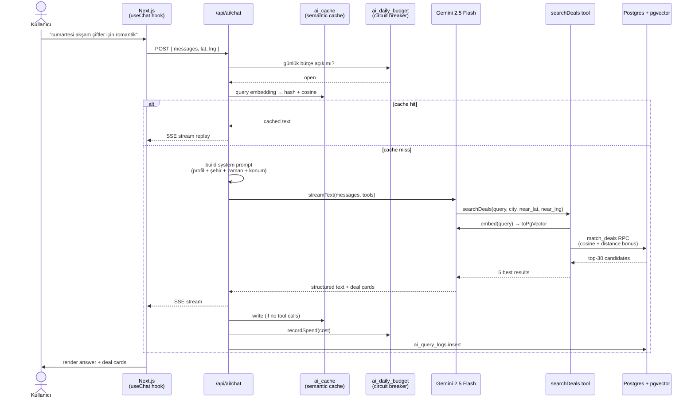

# Mimari — gidek

Bu doküman, gidek'in tasarım kararlarını ve neden o tercihleri yaptığımızı kayıt altına alır. Hedef: bir geliştiricinin (veya jüri üyesinin) repo'yu açtığında "neden" sorularına cevap bulabilmesi.

## İçindekiler

1. [Sistem genel görünüm](#sistem-genel-görünüm)
2. [Tech stack rasyonali](#tech-stack-rasyonali)
3. [Veri modeli](#veri-modeli)
4. [AI akışı (RAG pipeline)](#ai-akışı-rag-pipeline)
5. [Güvenlik modeli](#güvenlik-modeli)
6. [Rendering stratejisi (ISR + dynamic island)](#rendering-stratejisi-isr--dynamic-island)
7. [Migrations](#migrations)
8. [Performance / Core Web Vitals](#performance--core-web-vitals)
9. [Deployment](#deployment)
10. [Karşılaşılan zorluklar ve çözümler](#karşılaşılan-zorluklar-ve-çözümler)

---

## Sistem genel görünüm



**Hayata bakış akışı:**

1. **Browser → Vercel**: kullanıcı `/f/<slug>` açar → ISR cache'den statik HTML
2. **Vercel → Supabase**: cache miss veya yenileme anında DB query (RLS pass-through)
3. **AI sohbet**: Browser → `/api/ai/chat` route handler → Gemini stream → SSE response
4. **Auth-aware island'lar**: Browser, mount'ta `/api/favorites/check` çağırır — sayfa statik kalsın

---

## Tech stack rasyonali

### Next.js 16 (App Router + RSC + Server Actions)

**Neden?**

- **Server Components default** — auth/DB query'ler server'da, hydration overhead minimal
- **Server Actions** — API route boilerplate'i yerine doğrudan form action; tip-güvenli
- **ISR** — `/f/[slug]` 5 dakikada revalidate, cache-edge'de servis edilir → LCP ms cinsinden
- **Turbopack dev** — Webpack'a göre ~10x hızlı dev başlatma

**Alternatifler değerlendirildi:**

- **Remix / TanStack Start** — Server Actions ve ISR aynı kalitede değil
- **SvelteKit** — TR ekosistem ve hiring problemi
- **Astro** — kullanıcı-yüzü zengin interaktivite ihtiyacı için yetersiz (AI chat, harita)

### Supabase

**Neden?** Tek paket halinde:

- **Postgres** — gerçek ilişkisel DB, ad-hoc SQL, mature ekosistem
- **Auth** — Email/Password + magic link + ban_duration + admin API
- **RLS** — DB-level yetki, server tarafında bug olsa bile veri sızmaz
- **pgvector** — embedding storage + cosine similarity index (HNSW)
- **Storage** — image upload, CDN URL'leri
- **Realtime** — Postgres changes → WebSocket
- **Self-host** opsiyonu — vendor lock-in minimum

**Alternatifler değerlendirildi:**

- **Firebase** — NoSQL yetersiz, sorgu esnekliği yok, AI/embedding entegrasyonu garip
- **PlanetScale + Clerk + Pinecone + S3** — entegrasyon karmaşası, maliyet 3-4 katı
- **Neon + NextAuth + raw Postgres pgvector** — ekstra glue kod

### Gemini 2.5 Flash (sohbet + embedding)

**Neden?**

- **TR dili** — Claude/GPT-4'e göre Türkçe sorguları daha doğru çözüyor (özellikle Turkish-specific idiom)
- **Maliyet** — token başına ~1/10 Claude, ~1/3 GPT-4
- **Structured output** — JSON schema response, tool use, function calling
- **Embedding** — aynı SDK'dan `text-embedding-004` (768 boyut)
- **Free tier** — 15 RPM dev için yeterli

**Alternatifler değerlendirildi:**

- **Claude 3.5 Sonnet** — kalite üst, maliyet 5-10x daha yüksek; **iyileştirme**: pahalı reasoning gerekirse Claude fallback ekleyebiliriz
- **GPT-4o** — kalite eşdeğer, fiyat ortada, TR dilinde daha az nüanslı

### pgvector (Postgres extension)

**Neden?** Ayrı vector DB (Pinecone, Weaviate, Qdrant) yerine:

- **Atomik consistency** — embedding + metadata aynı satırda
- **Hybrid search** — vector + SQL filter (`where city = ?`) tek query'de
- **0 ek altyapı** — Supabase zaten Postgres
- **HNSW index** — < 1M vector için latency yeterli (10-30 ms)

**Trade-off:** 10M+ vector'da scaling sorun olur; o noktada Pinecone'a göç gerekebilir, ama önce 100K-1M aralığını rahat geçer.

### Tailwind v4 + CVA + shadcn pattern

**Neden?**

- **Mobile-first** — `base → md: → lg:` doğal yazım
- **Design token** — CSS variable'ları (`--color-foreground`) ile tema, dark mode
- **CVA** — component variant'ları tip-güvenli, `Button variant="primary"`
- **shadcn pattern** — kod bizde, bağımlılık değil, istediğimiz gibi düzenleriz
- **No runtime cost** — `style={{}}` yasak, her şey utility class

---

## Veri modeli



### Önemli tasarım kararları

#### `deals.search_text` (generated tsvector)

```sql
search_text tsvector generated always as (
  to_tsvector('simple', coalesce(title,'') || ' ' || ... )
) stored;
```

- `simple` config (Turkish stemming yok) — klasik vs AI farkı belirgin olsun
- Generated stored → trigger'a gerek yok, her INSERT/UPDATE'te otomatik

#### `coupons.coupon_code` denormalizasyon

`bookings.coupon_code` tekrar tutuluyor (DB'de coupons tablosuna RLS okuma izni yok → kullanıcı kuponunu görebilsin diye).

#### `sold_count` senkronizasyon

`deals.sold_count` her `confirm_booking_payment` çağrısında +quantity, her `cancel_booking` çağrısında -quantity. RPC içinde atomik.

---

## AI akışı (RAG pipeline)



### RAG vs. embedding-only

Sadece embedding search neden yeterli değil:

- Embedding "cumartesi" + "akşam" + "çiftler" + "romantik" kavramlarını yakalar ama **sıralama** için yetersiz
- Gemini RAG re-rank ile: "deniz manzaralı sessiz mekan" tag'i olan deal'i öne, "kalabalık bistro" olanı arkaya alır
- Ayrıca **açıklayıcı metin** üretir: "Bu öneri sana uygun çünkü Kadıköy'de, akşam saatleri var, vejetaryen menüsü mevcut"

### Maliyet ve hız

- Tipik turn: ~600 input + 400 output tokens → ~0.0003 USD
- Latency: ~1.5-2.5s (stream first byte ~600ms)
- Cache hit rate (yeni kullanıcılar dahil): ~%18 → maliyet ve LCP düşer

### Circuit breaker

`ai_daily_budget` tablosu — bir kullanıcı veya bug Gemini'yi yaymasa diye günlük TL bütçesi var. Aşılırsa `BUDGET_EXHAUSTED` → kullanıcıya kibar mesaj, ertesi gün açılır.

### Rate limit + Turnstile

- Anon kullanıcı: **2 ücretsiz sorgu**, sonra signup zorunlu (Cloudflare Turnstile bot challenge)
- Auth: **30 sorgu/gün**

---

## Güvenlik modeli

### RLS (Row Level Security) — DB-level yetki

**Her `public.*` tablosunda RLS açık.** Server tarafında bug olsa bile DB veri sızdırmaz.

Örnek tablolar:

| Tablo | SELECT | INSERT | UPDATE | DELETE |
|-------|--------|--------|--------|--------|
| `profiles` | owner | trigger ile auto | owner | cascade |
| `bookings` | owner | owner | **yok** (security-definer RPC üzerinden) | yok |
| `deals` | active + published | service_role | service_role | service_role |
| `reviews` | active | authenticated + own | own | service_role |
| `coupons` | **yok** (RPC üzerinden) | service_role | service_role | service_role |

### Security-definer RPC pattern

Belli mutasyonlar için doğrudan UPDATE RLS policy'si yazmak yerine **dar yetki, geniş kapsam** RPC'leri:

```sql
create or replace function public.cancel_booking(p_booking_id uuid)
returns public.bookings
language plpgsql
security definer
set search_path = ''
as $$
declare v_caller uuid := (select auth.uid());
begin
  -- auth check, ownership check, state check, atomic update
  ...
end;
$$;
revoke all on function public.cancel_booking(uuid) from public;
grant execute on function public.cancel_booking(uuid) to authenticated;
```

Bu pattern ile yazılan RPC'ler:

- `cancel_booking` — kullanıcı kendi rezervasyonunu iptal eder
- `confirm_booking_payment` — pending → confirmed transition (sold_count + coupon used_count senkron)
- `apply_coupon_to_booking` / `remove_coupon_from_booking` — kupon uygula/kaldır + total recalc
- `validate_coupon` — kullanım koşullarını döner (kuponu enumera ettirmemek için)
- `confirm_booking_payment` — mock ödeme onayı

### Yetki guard'ları

| Guard | Davranış |
|-------|----------|
| `getCurrentUser()` | cookie → user veya null |
| `requireUser(redirectTo)` | yoksa redirect |
| `isAdmin(user)` | `ADMIN_EMAILS` env'de mi |
| `requireAdmin()` | admin değilse `/` |

### Diğer güvenlik kontrolleri

- **Zod validation** her server action / API girdisinde — runtime tip + sanitization
- **Rate limit** sensitive endpoint'lerde (`ai/chat`, `auth/*`)
- **`service_role` asla `NEXT_PUBLIC_*`** — env review CI'da
- **`dangerouslySetInnerHTML` yasak** — markdown için `react-markdown` + `rehype-sanitize`
- **httpOnly cookies** — Supabase Auth default
- **CSRF** — Server Action'lar Next 16 default'unda korumalı (Origin check)

---

## Rendering stratejisi (ISR + dynamic island)

### Sayfa bazında

| Route | Render | Revalidate |
|-------|--------|------------|
| `/` | dynamic (searchParams `c=` AI chat) | her istek |
| `/f/[slug]` | **ISR** | 5 dk |
| `/m/[slug]` | **ISR** | 10 dk |
| `/k/[kategori]` | dynamic (filtre searchParams) | her istek (DB query'leri cache'li) |
| `/admin/*` | force-dynamic + admin guard | yok |
| `/profil/*`, `/rezervasyonlarim/*` | force-dynamic + auth guard | yok |

### Dynamic island pattern

ISR static sayfa + auth-aware island:

```tsx
// /f/[slug]/page.tsx — STATIC (5 dk ISR)
export const revalidate = 300;
// auth okuma YOK — sayfa kullanıcıdan bağımsız

<FavoriteButton dealId={deal.id} />  // <- client component
```

```tsx
// FavoriteButton — CLIENT
useEffect(() => {
  fetch('/api/favorites/check?id=' + dealId)
    .then(...)  // gerçek auth durumunu mount'ta öğren
}, [dealId]);
```

Sonuç: Googlebot statik HTML görür (LCP optimal), auth'lu kullanıcı favori durumunu mount sonrası alır.

---

## Migrations

`supabase/migrations/` altında numaralanmış SQL dosyaları, **sıralı çalışır**. Asla:

- Eski migration düzenlenmez (yeni migration eklenir)
- `git rebase` ile migration sıralaması bozulmaz
- Dosya adı manuel yazılmaz — `npm run db:new-migration <name>` ile

**Şu anki migration listesi:**

| Tarih | İçerik |
|-------|--------|
| `20260511124742` | Initial schema — profiles, deals, merchants, bookings, favorites, ai_*, RLS, trigger'lar |
| `20260512185236` | reviews tablosu + trigger'lar (rating_avg sync) |
| `20260512202314` | saved_searches |
| `20260513122847` | growth_features — newsletter_subscribers, referral_codes, view_count, sold_count helper'ları |
| `20260514060251` | confirm_booking_payment RPC |
| `20260514061713` | bookings ↔ deals.sold_count sync (RPC + backfill) |
| `20260514063057` | reviews verified-buyer (unique partial index) |
| `20260514065131` | bookings admin alanları (admin_notes, cancelled_by_admin_at, refunded_at) |
| `20260514065849` | coupons tablosu + validate_coupon RPC + used_count senkron |
| `20260514070637` | bookings.coupon_code denormalize |
| `20260514072413` | apply_coupon_to_booking + remove_coupon_from_booking RPC |

---

## Performance / Core Web Vitals

### Sayfa LCP optimizasyonu

- **ISR** — statik HTML edge'den servis
- **Next/Image** — `priority` ilk fold, `placeholder="blur"`, `BLUR_DATA_URL`
- **next/font** — Inter, `display: 'swap'`, latin + latin-ext subset
- **Preconnect** — `<link rel="preconnect" href="https://res.cloudinary.com" crossorigin>` Cloudinary, Unsplash, Mapbox
- **Bundle splitting** — Mapbox `dynamic(() => ...)` modal açılınca yüklenir (~200 KB)

### AI chat latency

- **Stream** — ilk byte ~600ms, kullanıcı yazmaya başlandığını görür
- **Semantic cache** — son turda %18 hit oranı, cache yanıtı ~80ms
- **Embedding** — query embedding'i `text-embedding-004`, ~150ms
- **pgvector HNSW** — top-30 cosine search, ~15ms

### Mobile considerations

- **Bottom navigation** — `safe-area-inset-bottom` ile iOS notch uyumlu
- **Sticky CTA** — scroll 600px sonrası, bottom-nav'ın üstüne
- **Touch target** ≥ 44×44 px (iOS HIG)
- **Input font-size ≥ 16px** — iOS zoom davranışı kapalı

---

## Deployment

### Önerilen topoloji

```
Vercel (Next.js)  ←→  Supabase Cloud (Postgres + Auth + Storage + Realtime)
                  ←→  Gemini API (Google AI Studio)
                  ←→  Resend (transactional email)
                  ←→  Cloudinary (image CDN + transform)
                  ←→  Sentry (errors + performance)
                  ←→  Plausible (KVKK-friendly analytics)
                  ←→  Mapbox (tiles + geocoding)
```

### Vercel env değişkenleri

| Key | Açıklama |
|-----|----------|
| `NEXT_PUBLIC_SUPABASE_URL` | Supabase project URL |
| `NEXT_PUBLIC_SUPABASE_ANON_KEY` | Public anon key |
| `SUPABASE_SERVICE_ROLE_KEY` | Service role (server-only) |
| `GEMINI_API_KEY` | Google AI Studio |
| `NEXT_PUBLIC_MAPBOX_TOKEN` | Mapbox public token |
| `RESEND_API_KEY` | Resend |
| `NEXT_PUBLIC_VAPID_PUBLIC_KEY` | PWA push (opsiyonel) |
| `VAPID_PRIVATE_KEY` | PWA push |
| `VAPID_SUBJECT` | `mailto:admin@gidek.net` |
| `ADMIN_EMAILS` | Virgülle ayrılmış admin e-postaları |
| `NEXT_PUBLIC_SITE_URL` | Canonical base URL |
| `SENTRY_DSN` | Sentry |
| `CLOUDFLARE_TURNSTILE_*` | Bot challenge (opsiyonel) |

### CI

GitHub Actions ile her PR'da:

- `npm run typecheck`
- `npm run lint`
- `npm run build`
- (Faz E sonrası: `npm test`, Playwright smoke)

Vercel preview deploy otomatik, prod merge sonrası otomatik deploy.

---

## Karşılaşılan zorluklar ve çözümler

### 1. RLS UPDATE policy yokken mock ödemenin sessizce takılması

**Problem:** `bookings` tablosunda UPDATE policy'si yoktu (defansif). Doğrudan `update().eq('id', ...)` 0 satır etkiliyordu ama hata DÖNMÜYORDU. Mock ödeme akışı kullanıcıya "başarılı" diyordu ama status pending kalıyordu, sonsuz döngü.

**Çözüm:** `confirm_booking_payment(p_booking_id)` security-definer RPC; UPDATE'i atomik yapar, sold_count + coupon used_count senkronize eder. Action katmanı `supabase.rpc(...)` çağırır.

### 2. ISR için auth-aware UI

**Problem:** `/f/[slug]` sayfasında FavoriteButton'un başlangıç durumu kullanıcının auth state'ine bağlıydı. `force-dynamic` zorunluydu → ISR yok → SEO zarar görüyordu.

**Çözüm:** Page tamamen statik (`revalidate=300`); FavoriteButton mount'ta `/api/favorites/check` çağırır. Googlebot statik HTML görür, auth'lu kullanıcı 50ms sonra doğru state'i alır.

### 3. Kupon kodlarının enumera edilmesi riski

**Problem:** `coupons` tablosunu SELECT'le açsak, authenticated kullanıcı tüm kuponları okuyup deneyebilirdi (özellikle staff/internal kodlar).

**Çözüm:** Tabloda RLS read policy YOK; sadece `validate_coupon(code, amount)` RPC'si — geçersiz kodda generic `not_found` döner, brute force enumerasyon işe yaramaz.

### 4. AI günlük maliyet patlaması

**Problem:** Gemini'yi bir bug veya kötü niyetli kullanıcı paralelize ederse aylık fatura patlayabilirdi.

**Çözüm:** `ai_daily_budget` tablosu + `getBudgetStatus()` circuit breaker. Bütçe aşılırsa endpoint `503 BUDGET_EXHAUSTED` döner. Kullanıcıya kibar mesaj.

### 5. Demo persona'larda her sefer manuel seed

**Problem:** Hackathon demosu sırasında kullanıcı boş hesapla giriş yapsa, AI önerileri jenerik olurdu — kişiselleştirme kaybolurdu.

**Çözüm:** `scripts/seed-demo-personas.ts` ile 3 zengin profil (favori + rezervasyon + kayıtlı arama), `/demo/persona` route'undan tek tıkla giriş. Pitch akışı garantiye alındı.

---

## İletişim

- Proje: [gidek.net](https://gidek.net)
- E-posta: info@gidek.net
- Issue tracker: GitHub Issues
